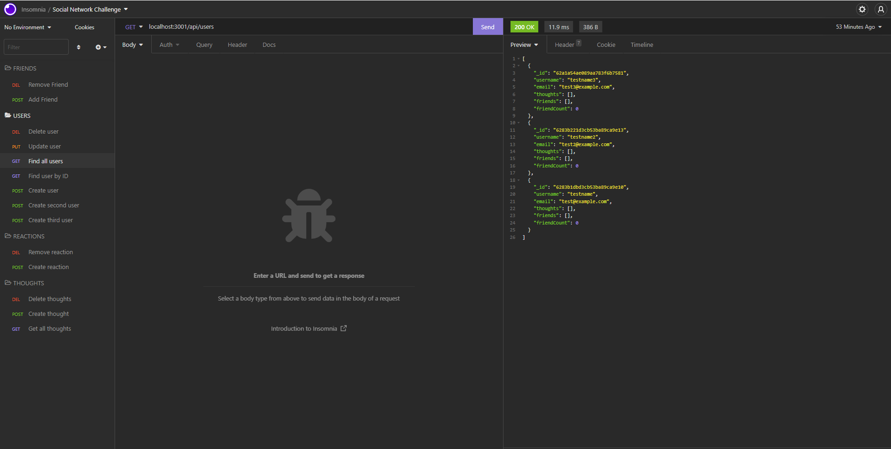
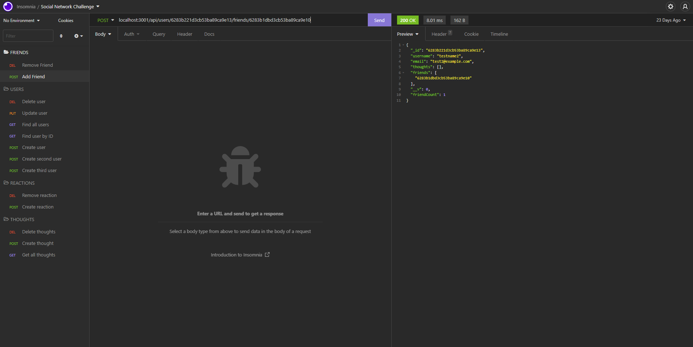
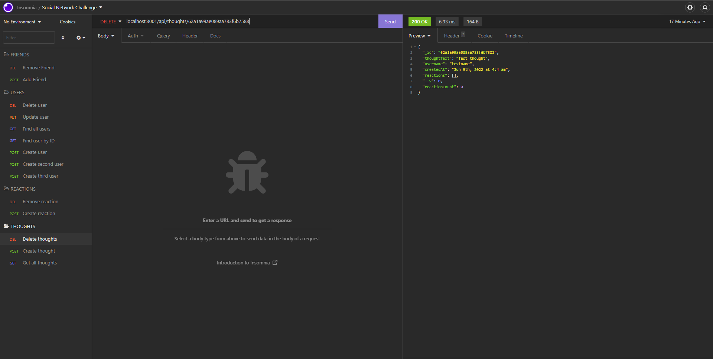

# social-network-api

## Table of Contents

-[Description](#Description)

-[Programming Languages, Technologies/Frameworks](#Programming-Languages,-Technologies/Frameworks)

-[Installation](#Installation)

-[Contribution](#Contribution)

-[URL](#URL)

## Description

Built an API for a social network web application where users can share their thoughts, react to friends’ thoughts, and create a friend list. There's also an option to remove users, friends, reactions and thoughts.

## Programming Languages, Technologies/Frameworks

- Javascript
- NoSQL
- Express.js
- Mongoose
- Insomnia

## Installation

1. Npm i
2. Npm start
3. Open insomnia

## Contribution

true

### Screenshots

### Walkthrough Videos

[Tutorial1]https://drive.google.com/file/d/1AFw4WdiRUNpyWztnCSnQvnignqb-gsyW/view 
[Tutorial2]https://drive.google.com/file/d/1id41B1wrPmJoqlPIJA0_Q_5Ebe4v-zwC/view 
[Tutorial3]https://drive.google.com/file/d/1xErGqWa4Wb2esbVW29Fs9IetnzCqSFVF/view 

### URL of the GitHub repository:

<https://github.com/adorsey5/social-network-api>
